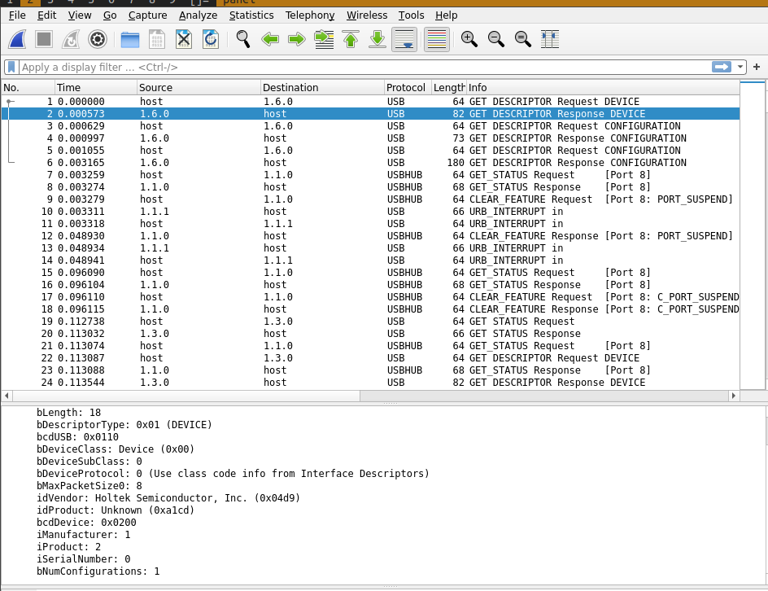
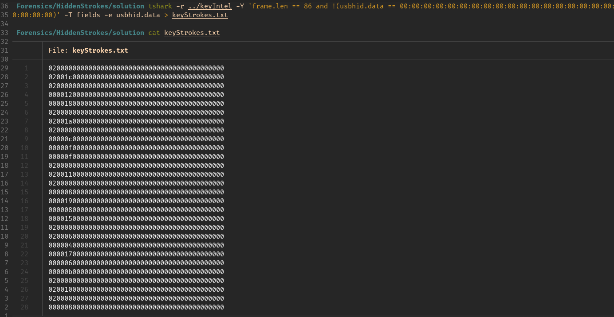

We are given a **pcap** file and on opening it in a program like **wireshark**, we can see that it is usb capture data. We can try and find the type of usb device by looking at the **GET DESRIPTOR Response DEVICE** and searching for it.

Now that we have an idea that it is a USB keyboard, we have to figure out what data is being sent. If we look at the **USB INTERRUPT**'s that are coming in, and observe that the HID Data is constantly changing, which gives us an idea that this might be letters typed on a keyboard. As for decoding this, we can first get only the useful capture data in textform by using a program like **tshark**.

Now that we have our key strokes in a file, we need to decode them. As far the complexity of the question is concerned, the main thing to be understood is that the first two bits denote if a modifier like **Shift** is pressed and the next 2 the actual **value** of the key being pressed down. For more info on USB packet captures, visit [this](https://bitvijays.github.io/LFC-Forensics.html)

We can use this info to decode the text with a script like [this](solution/solve.py)
